##1. 
a) _cat_komento kohdentaa haluamaamme asiaan, tässä tapauksessa /var/log/syslog oleva syslog tekstitiedostoon. | - komento putkittaa sen wc -l -komennon kanssa, eli syslog tehdään wc -l -komento, joka laskee syslog tekstin rivimäärän, joita on 8191.
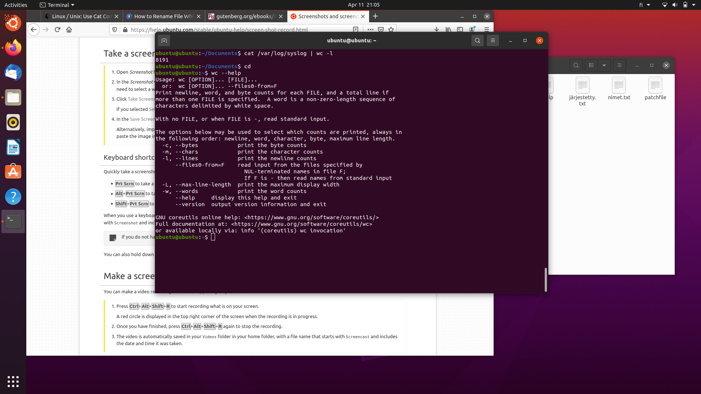

b) _ls -l_ 
luettelee nykyisen hakemiston pitkästi, ja se putkitetaan | -komennolla sort -r -komentoon, joka kääntää tulokset vastaikkaiseen järjestykseen ja se putkitetaan | more -komentoon. More komento näyttää tuloksen terminaaliin mahtuvaksi tavallaan luoden sivuja, eli voimme selata sitä sivuttain jos olisi listamme ollut pidempi. 
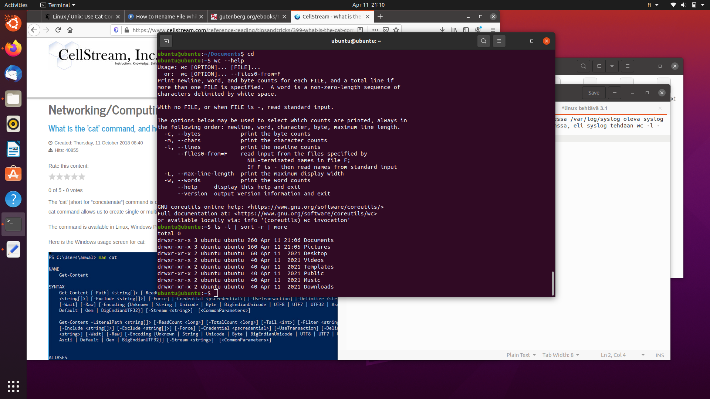

c)
 ls listaa nykyisen hakemiston sisällön, se putkitetaan head -3, joka esittää 3 ensimmäistä tulosta, se putkitetaan tail -1, joka esittää viimeisen tuloksen ja nämä luodaan myoutput tekstitiedostoon. Kuvankaappauksessa nähdään, että siellä lukee Downloads, mikä tekee järkeen. 
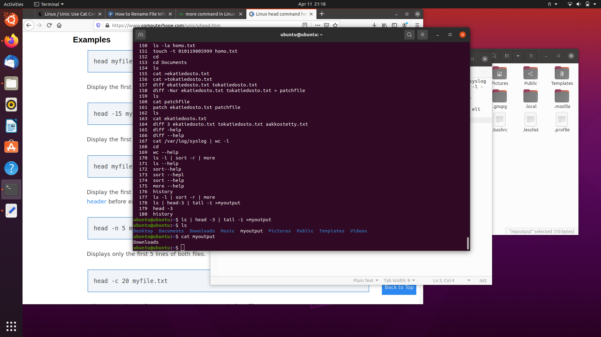

##2.
a) Kaikkien mp3 päätteisten tiedostojen löytäminen locate-komennolla kävisi:
_locate *.mp3_
Tällä kertaa ei koneessani ollut .mp3 tiedostoja.
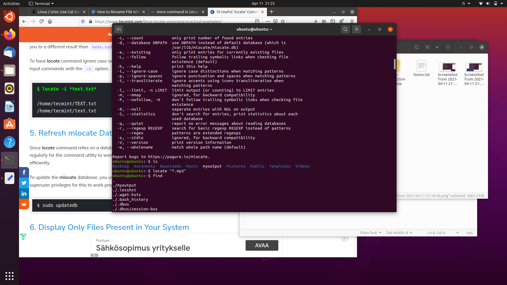

b) Tänään muokatut tiedostot löydän: 
_find . -mtime -1 -print_

. -mtime -1 kuvastaa yhden päivän aikana tapahtuneita muutoksia.
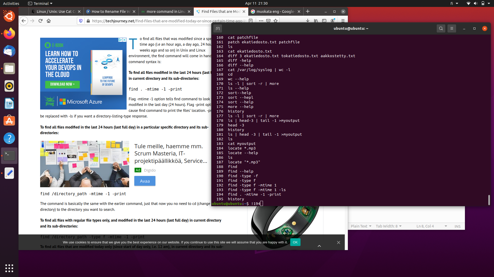

c) Kaikki yli 10MBm koon tiedostot löydämme: 
_find . -type f -size -10M_

##3.
a) Koko kotihakemiston pakkaaminen tar.gz -pakettiin luonnistuu: 
_tar -zcvf home.tar.gz /home_
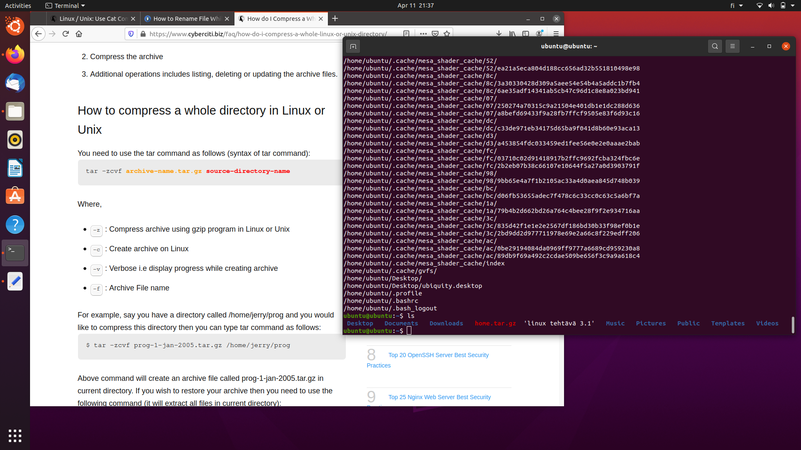

b) Siirretään ensin luomani gz-paketti muualle. XZ-pakkausohjelmalla saamme saman kuin a) kohdassa : 
_tar cJvf home.tar.xz /home_
-komennolla.
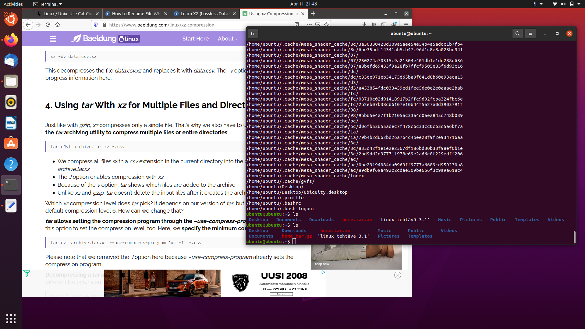

c) Luomani tiedostojen koko erot ovat: 79M gz, 144M xz. Eli gz-pakkaus on tehokkaampi, melkeinpä kaksinkertainen puristuskoko.
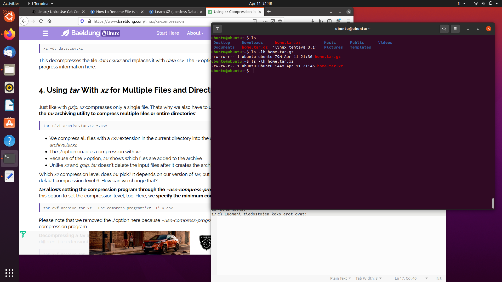

##4. 
a)Käytin tehtävissä https://chmod-calculator.com/. Kaikille luku ja kirjoitusoikeuksien antaminen tapahtuu: 
_chmod +666 (tiedosto)_ ja _chmod a=rw (tiedosto)_
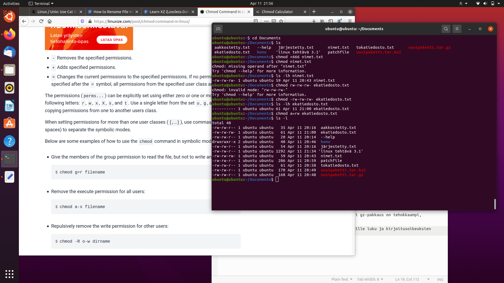

b) Kohdan a kirjoitusoikeuksien poisto kaikilta tapahtuisi 
_chmod a-w (tiedosto) ja chmod 222 (tiedosto)_
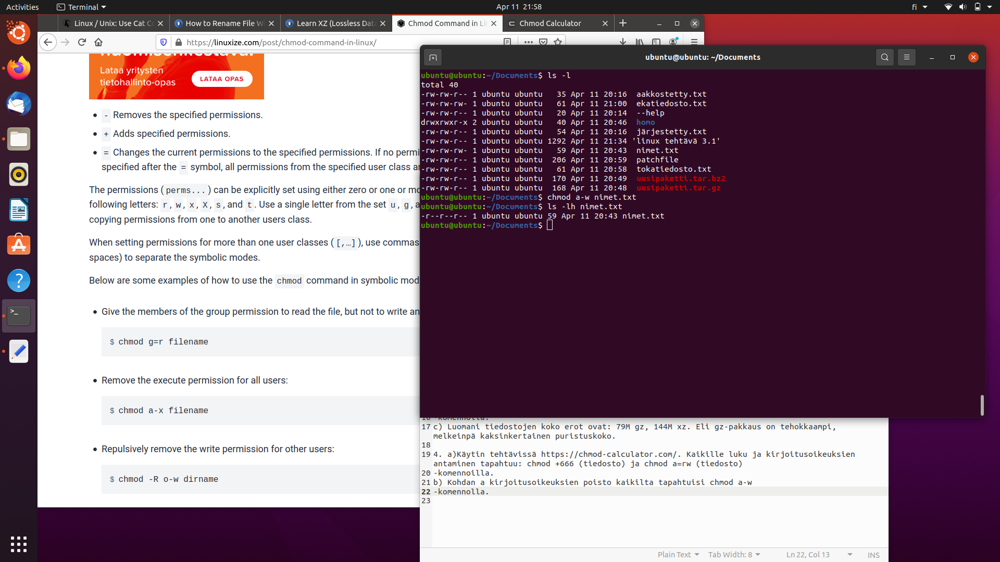

c) Tehdään uusi hakemisto, nimeltään moses. Sillä on kaikilla oikeudet lukea, mutta vain omistajalla on luku ja suoritusoikeus. Se luodaan: 
_chmod 744 moses ja chmod u=rwx,go=r moses_
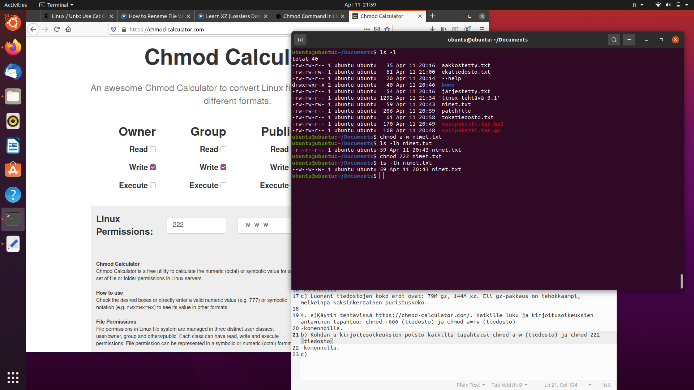

