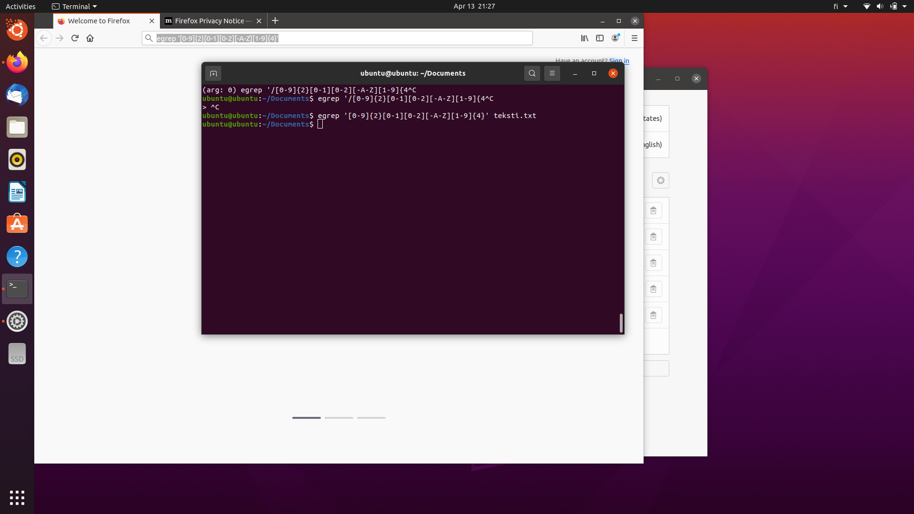
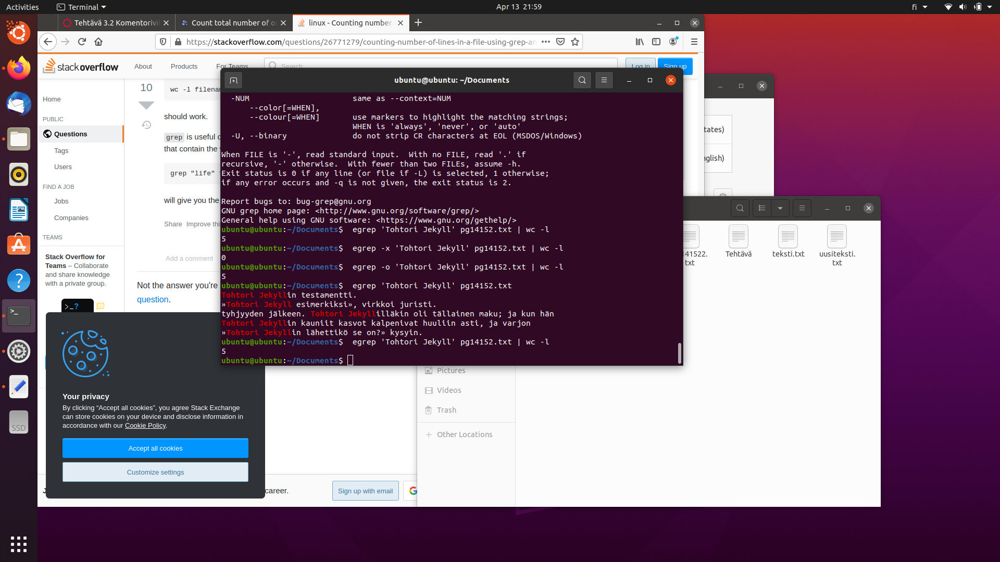
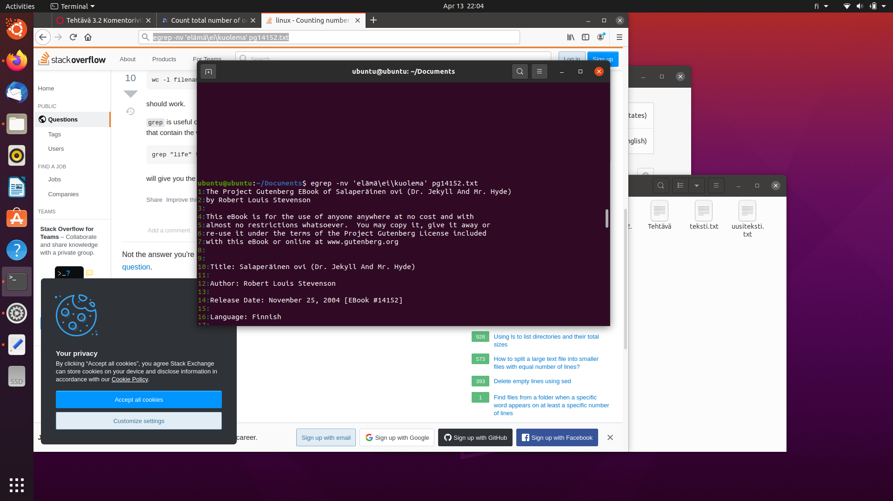
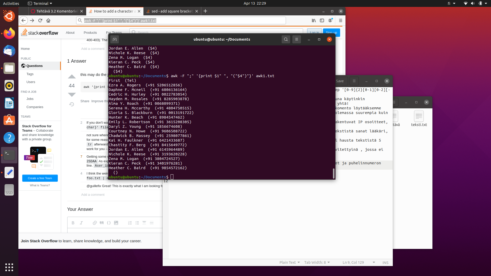
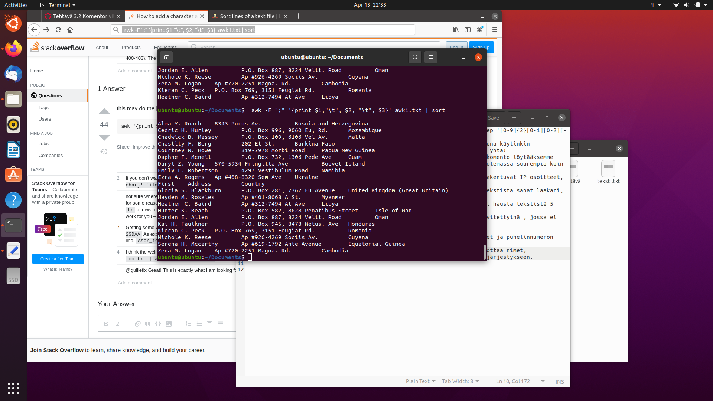
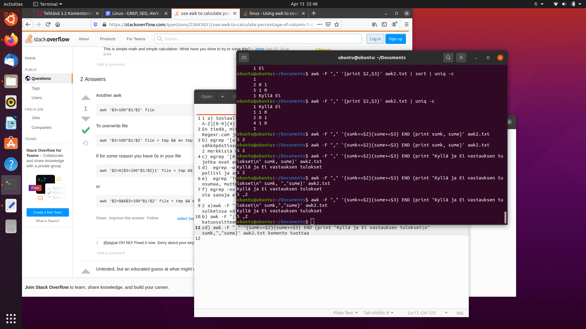
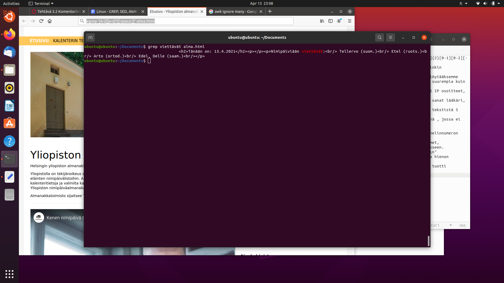
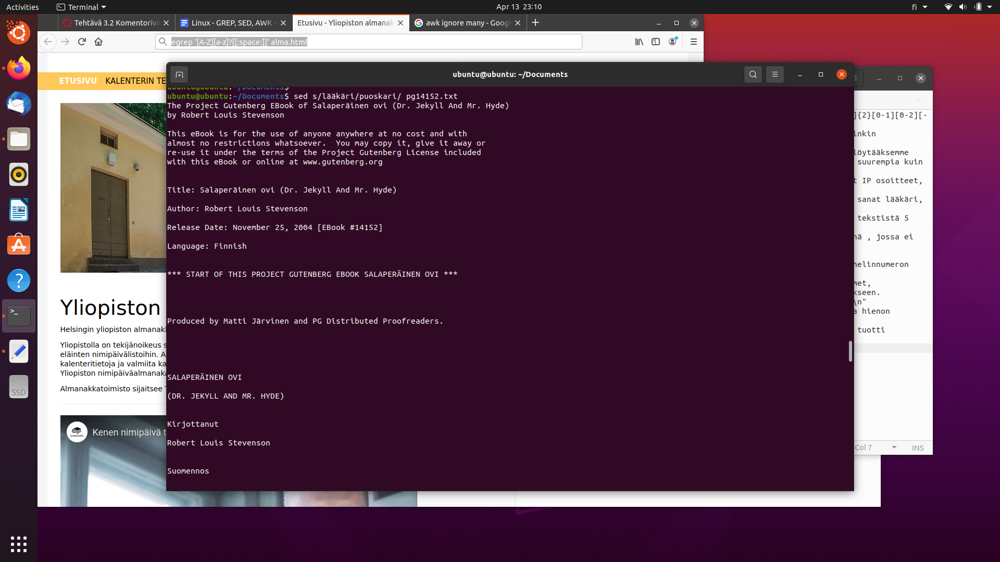
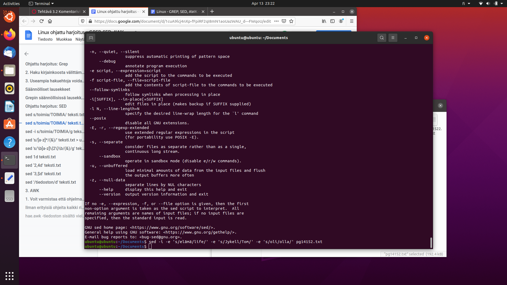
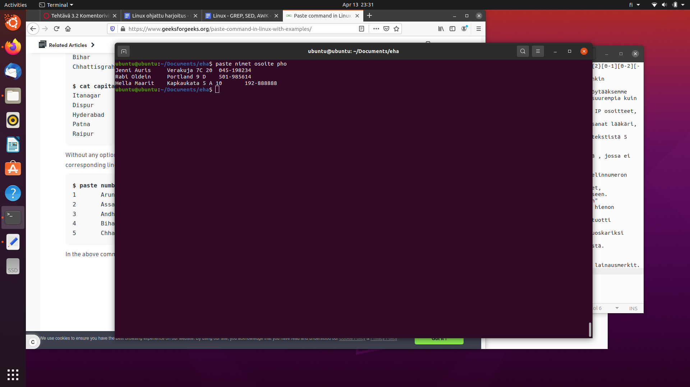

1 a) Sosiaaliturvatunnuksen voidaan tekstin seasta saada komennolla: egrep '[0-9]{2}[0-1][0-2][-A-Z][0-9]{4}' teksti.txt
En tiedä, mitä NNNK tarkoittaa, joten uskoin sen tarkoittavan vuotta. Apuna käytinkin Regexr.com joka paljasti, että ei voi tehdä [0-31],se hakisi vain 0-3 ja yhtä!

b) egrep '[a-zA-Z<]?[.][a-zA-Z<]?[@][a-zA-Z<]?[.][a-z]?' olisi haluamme komento löytääksemme sähköpöstiosoitteen, jossa on etu- ja sukunimi erotettuna pisteellä. On olemassa suurempia kuin 2 merkkisiä domaintunnuksia.

c) egrep '[0-9]?[.][0-9]?[.][0-9]?[.][0-9]?' Toisi neljästä numeroista rakentuvat IP osoitteet, jotka ovat erottu pisteellä toisistaan. 

d)  egrep -w 'asianajaja|poliisi|lääkäri' pg14152.txt komento korostaa tekstistä sanat lääkäri, poliisi ja asianajaja yhdellä komennolla.

e)  egrep 'Tohtori Jekyll' pg14152.txt | wc -l komento tuo Tohtori Jekyll hausta tekstistä 5 osumaa, muttei tulosta niitä rivejä.

f) egrep -nv 'elämä\ei\kuolema' pg14152.txt komento tuo esiin tekstit rivitettyinä , jossa ei ole sanoja elämä, ei ja kuolema tekstistä.

2 a)awk -F ";" '{print $1" ", "("$4")"}' awk.txt komento tuottaa etunimet ja puhelinnumeron sulkeissa välilyönnillä erotettuna.

b) awk -F ";" '{print $1,"\t", $2, "\t", $3}' awk1.txt | sort komento tuottaa nimet, katuosoitteen ja asuinmaan sarkaimella erotettuna ja järjestää ne aakkosjärjestykseen.

cd) awk -F "," '{sumk+=$2}{sume+=$3} END {print "Kyllä ja Ei vastauksen tulokset\n" sumk,","sume}' awk2.txt komento tuottaa Kyllä ja Ei vastausten summan näytölle ja hienon otsikon.

e) EN saanut nimipäiväsankareita tulostettua AWk tai SED työkaluilla, mutta Grep tuotti tämänpäiväiset nimi päiväsankarit: grep viettävät alma.html

3. a) sed s/lääkäri/puoskari/g pg14152.txt komento muuttaa kaikka sanat lääkäri puoskariksi tekstissä.

b) sed '/maailma/d' pg14152.txt komento poistaa maailma-sanan olevat rivit tekstistä.

c) sed -i -e 's/elämä/life/' -e 's/Jykell/Tom/' -e 's/oli/olla/' pg14152.txt
komento vaihtaa kolme sanaa yhdellä kertaa suoraan tiedostoon.

d) sed 's/Enfield/"Enfield"' pg14152.txt komento lisää kaikkien Enfield ympärille lainausmerkit.

4 a) paste nimet osoite pho 
komento tuo kolmen eri tiedoston tekstit yhteen.

b) wc pg14152.txt osoittaa 3381 riviä olevan tekstissä. Split jälkeen tulostustiedoissa on oletuksena 1000 riviä.

c) split -l 500 pg14152.txt komento jakoi tekstin tiedostoihin joissa on 500 riviä. Valitsinta -l käytettiin.

de) sed '200,300d' pg14152.txt
komento poistaisi kaikki rivien 200 ja 300 välillä olevat tekstit.

