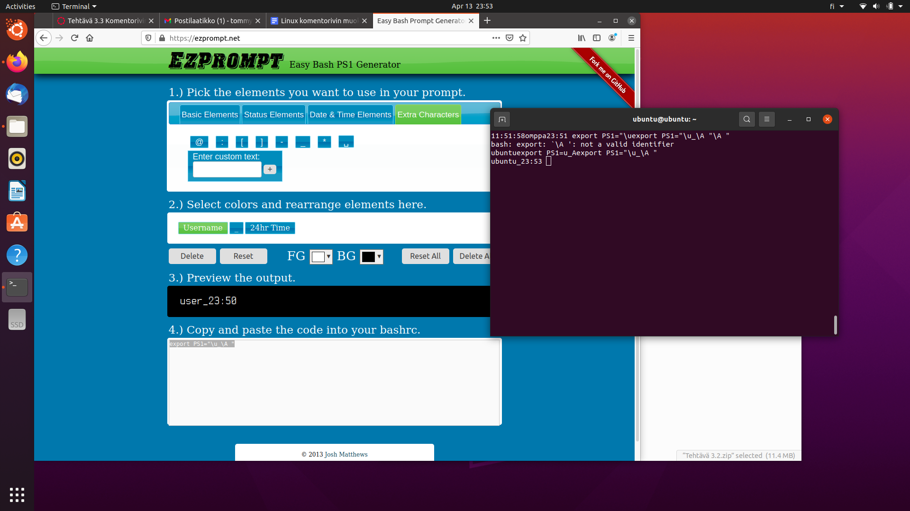
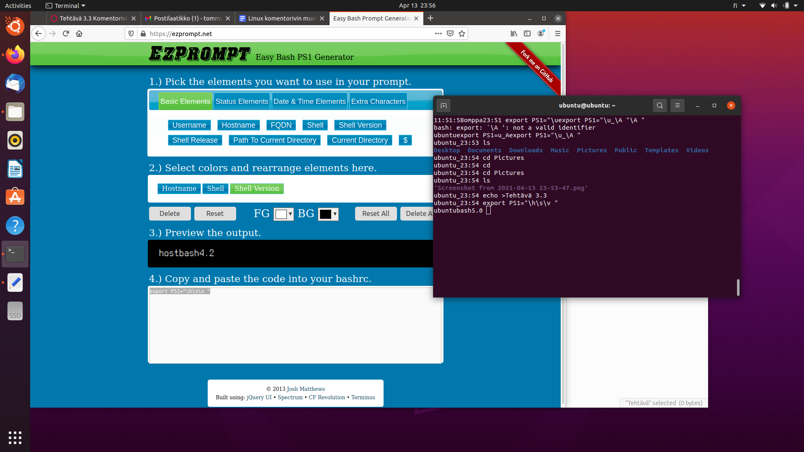
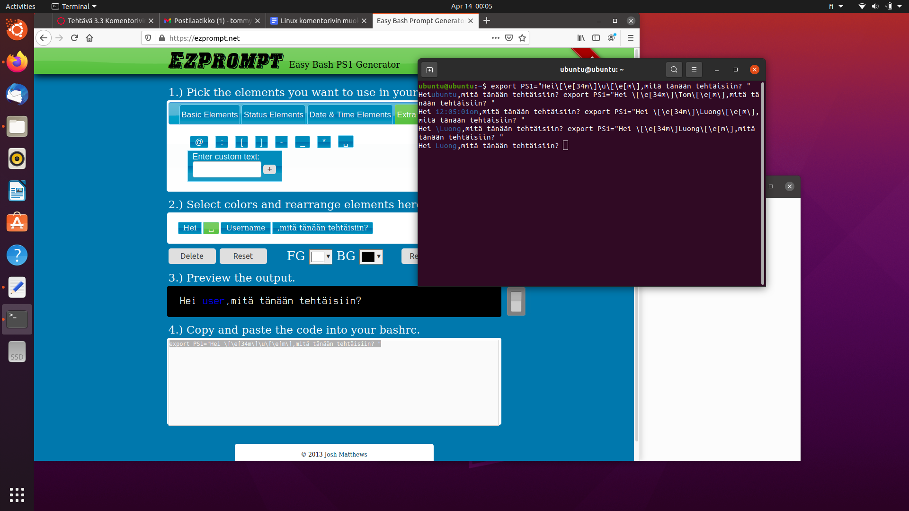
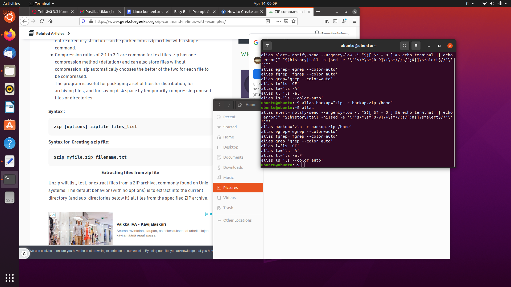

1.a) export PS1="\u_\A "

b) export PS1="\h\s\v "

c) export PS1="Hei \[\e[34m\]Luong\[\e[m\],mitä tänään tehtäisiin? "

2. a) alias backup="zip -r backup.zip /home"
Pakkaa koko kotihakemistoni.

b) alias poista="rm -i"
alias, joka kysyy poistaessa varmistusta.

c) alias juureen="cd /"
Alias, joka siirtää koko järjestelmän juurihakemistoon.

d) alias päivitä="sudo apt-get update"
Alias, joka päivitää pääkäyttäjän oikeuksin.

e)alias moo="cowsay -d moo"
Alias, joka todenteolla parantaa elämääni Linux käytössä.
