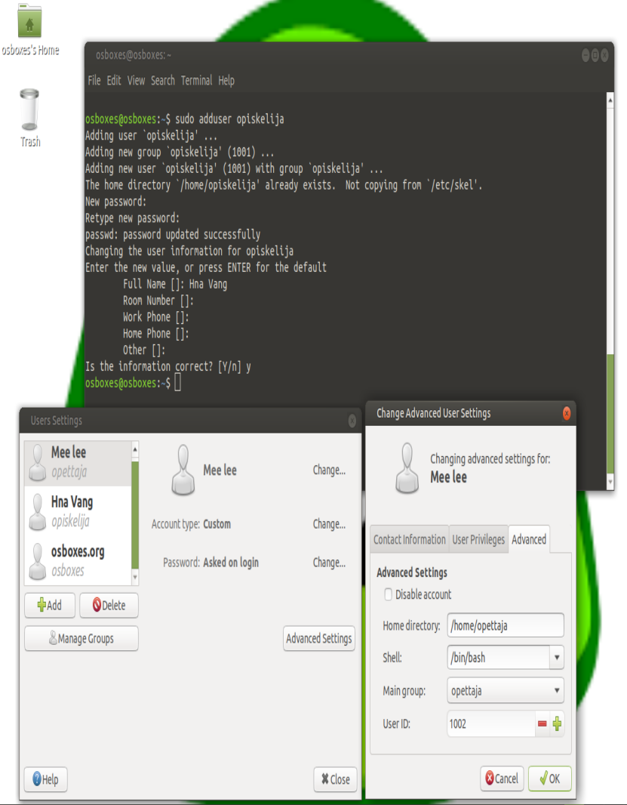
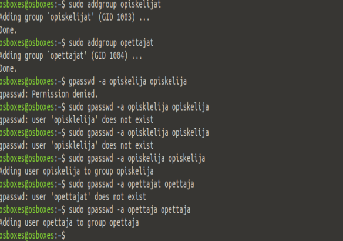
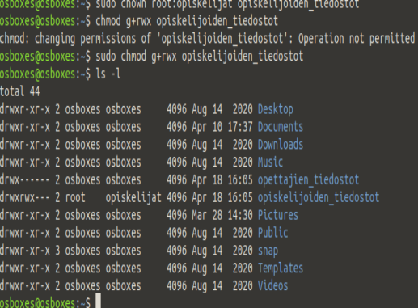
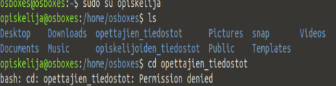
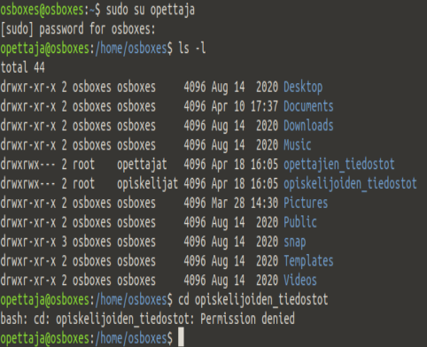
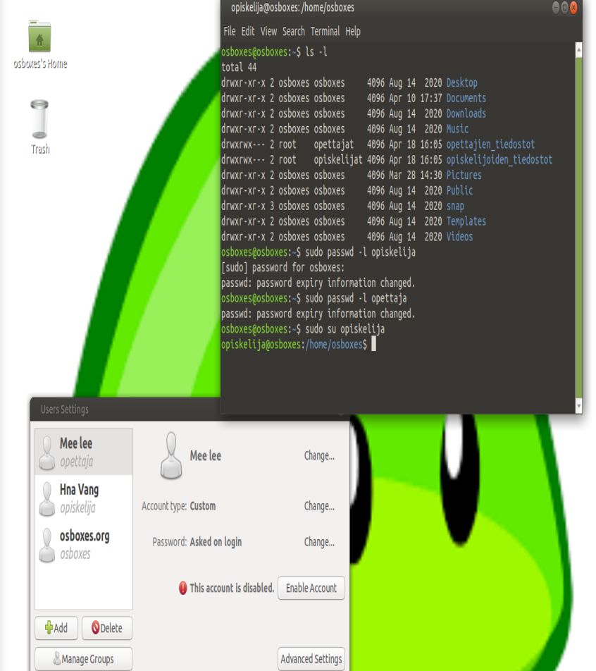

##Katso kuvat!

1. sudo adduser opiskelija / opettaja

2. sudo addgroup opiskelija / opettaja

3. sudo chown root:opiskelijat opiskelijoiden_tiedostot / sudo chown root:opettajat opettajien_tiedostot

chmod g+rwx opiskelijoiden_tiedostot / chmod g+rwx opettajien_tiedostot

4. sudo passwd -l opiskelija / opettaja
