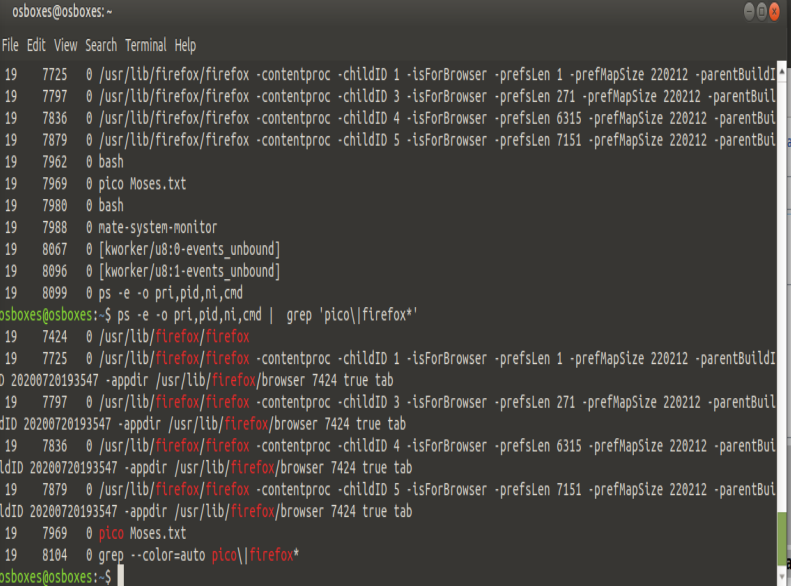
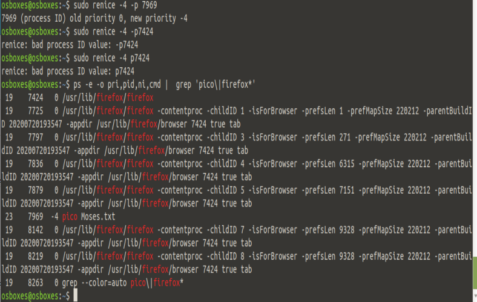
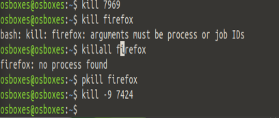
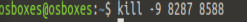
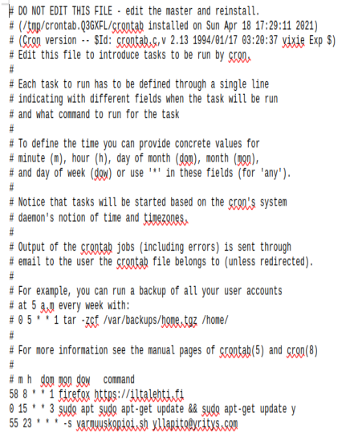

1. ps -e -o pri,pid,ni,cmd | grep ('ohjelma') tuo ohjelman tiedot esiin. pico -ohjelman PID on 7969 ja priority 19 ja firefox on monta PID mutta kaikki priority 19. 

2. sudo renice -4 p7969 muuuttaa nice valuetta -4:i.

3. kuvassa näkee tapoja sammuttaa ohjelmia. kill -9 piti käyttää, että saamme sammutettua firefox.

4.  Tehtävä yksi vastasi tähän hyvin.

5. kill -9 (PID) (PID) tappaa kaikki valitsemat PID. Tällä kertaa ne olivat firefox ja calc.

6. Kuvassa näkee miten sain aikaan crontab ajastetut toiminnat.

