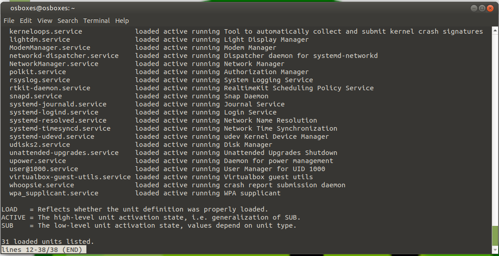
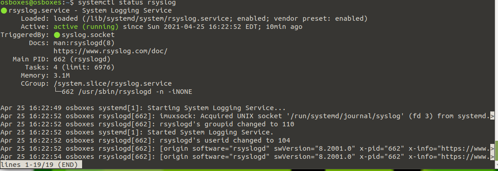
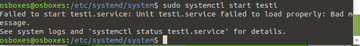

1. Komentoa sudo systemctl list-unit-files käyttämällä saamme esiin kaikki palvelut.

systemctl list-units --type service --state running taas tuo kaikki ajossa olevat palvelut esiin ja sieltä näemmekin rsyslog- nimisen palvelun. Palveluita on käynnissä 31.

rsyslog- niminen palvelu haetaan systemctl status rsyslog. Se on nytten enabled ja running ja sen main PID on 662.

Rsyslog on siis kuten syslog, paitsi hieman erilainen. Rsyslog on client/server- protokolla. Se toimii sillain, että joku lähettää pyynnön palvelimelle (Rsyslog) ja palvelin täyttää sen pyynnön takaisin lähettäjälle.
Se on olintärkeä verkonhallinnassa. Se on Linixulle tarkoitettu, mutta on olemassa ohjelmia joiden avulla jopa Windows voi ottaa vastaan syslog lokeja/viestejä.

2. Rsyslog käynnistetään uudelleen sudo systemctl start rsyslog.

3. testi.service luonti osoittautui erittäin vaikeaksi. Vaikka sellainen on /ect/systemd/system ja siinä lukee 

echo "Testi starttaa"
while :
do
[ -d "/home" ] && echo "Directory /home/ exists.";
sleep 15s;
done

Ei se toimi, vaan tulee virhe ilmoitus. Status kertoo 15 sekunnein välein, että onko /home hakemisto olemassa.

Toisaalta olen nähnyt muiden oppilaiden tekevän sen, mikä hämmästyttää hieman.