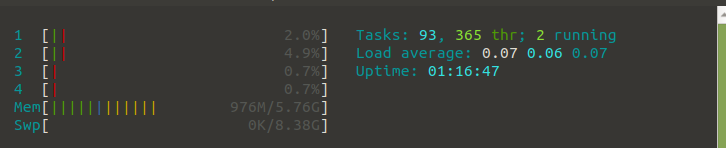

1. 

2. firefox

3. 1 tuntia ja 17 minuuttia.

4. Muistia on käytössä enintään 5,75G. (MEM osio)

5. firefox oli jo käynnissä ja se vei eniten muistia %.

6. Levylle on kirjoitettu Iostat mukaan edellisen käynnistyksen jälkeen 317676 kB. Dataa on luettu n. 900tuhattta kB.

7. Ulospäinen liikenne on ollut 815.52 kByte

8. Ja ladannut 13.03 MByte

9. IP koneella olisi 10.0.2.15

10. ping www.laurea.fi testiyhteys toimii. Se tuotti hitaasti kasvavan erittäin suuren listan pakettien lähettelyjä.

11. traceroute www.laurea.fi osoitti, että on olemassa maksimissaan 30 hyppyä, eli reititintä matkalla omasta virtuaalikoneesta laurean verkkosivuun. 

