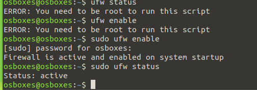
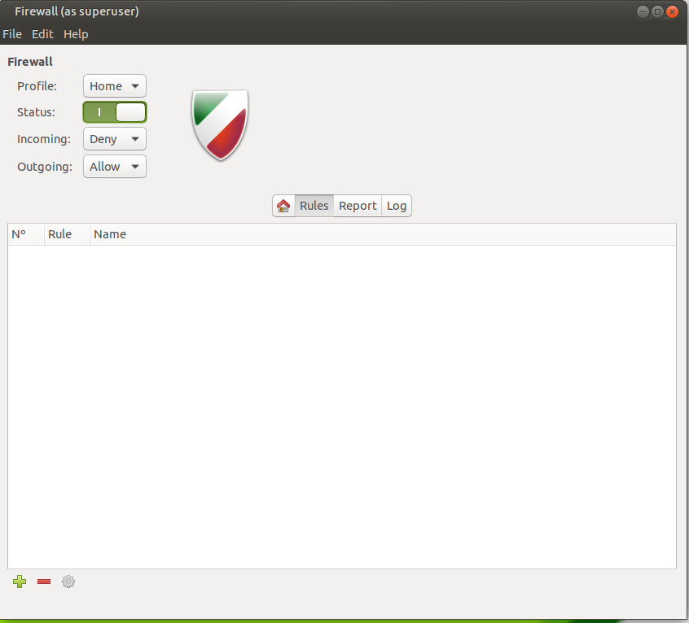
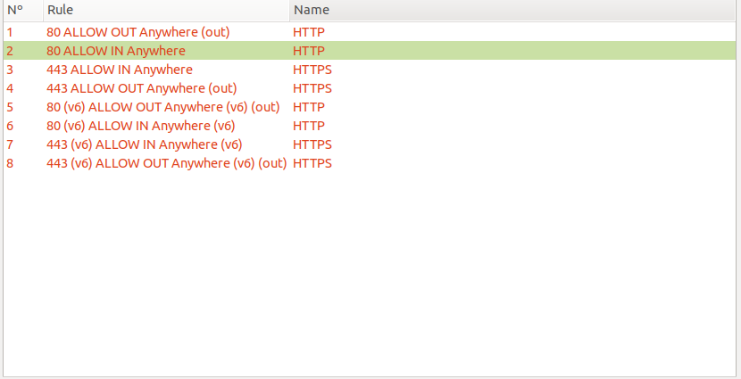
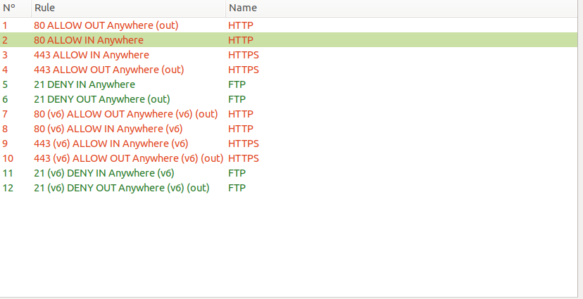
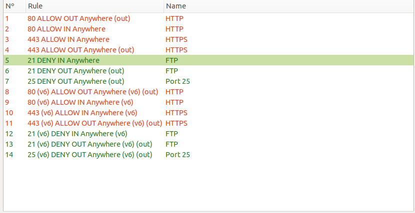
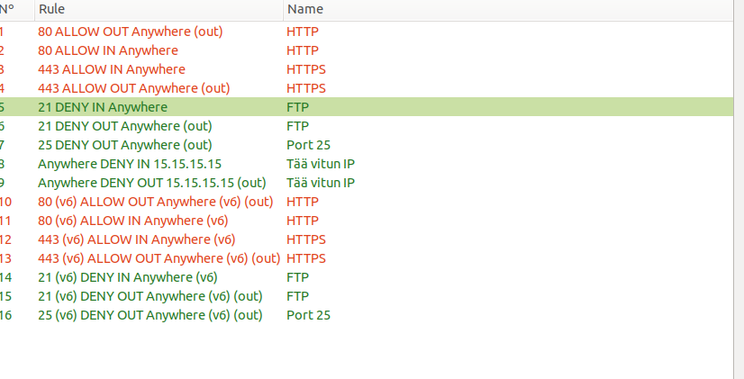
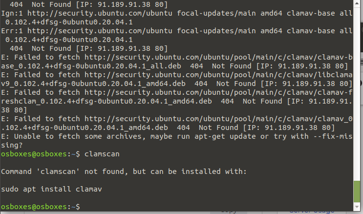
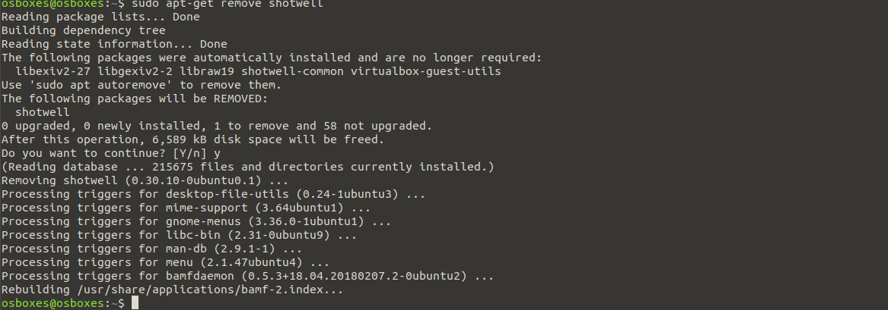
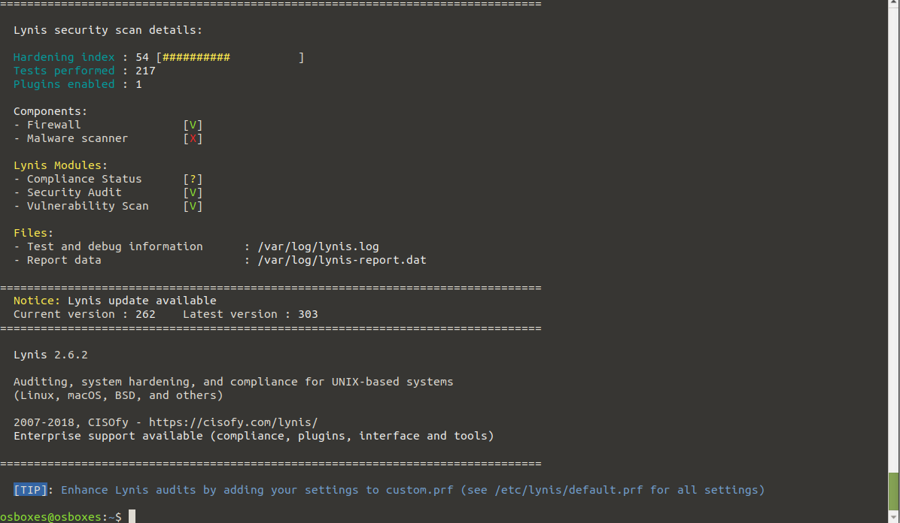

###A

1. ubuntu MATE on jo asennettu ufw ja gufw valmiiksi.

2. Palomuurissani (GUFW) ei ole oletuksena mitään sääntöjä.

3. Nyt sallin kaiken HTTPS ja HTTP liikenteen palomuurissani.

4. FTP liikenne kielletty palomuurissani.

5. Portti 25 liikenne ulospäin kielletty palomuurissani.

6.  IP 15.15.15.15 liikenne kielletty palomuurissani.

###B
En saannut ladattua clamav ubuntu MATE:n, enkä myöskaan update komennolla saanut kunnolla ladattua updatea.

apt-get remove shotwell poistaa turhan ohjelman.

Turvattomien protokollien poisto

Lynis scannaus palkastaa, että kaikki on "hyvin".

