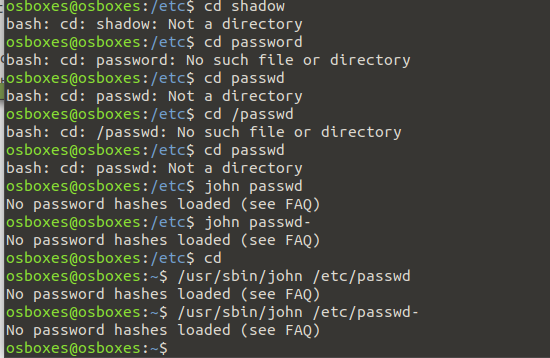
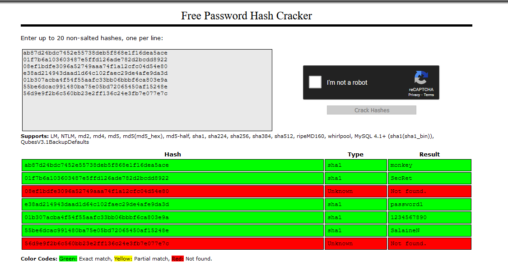
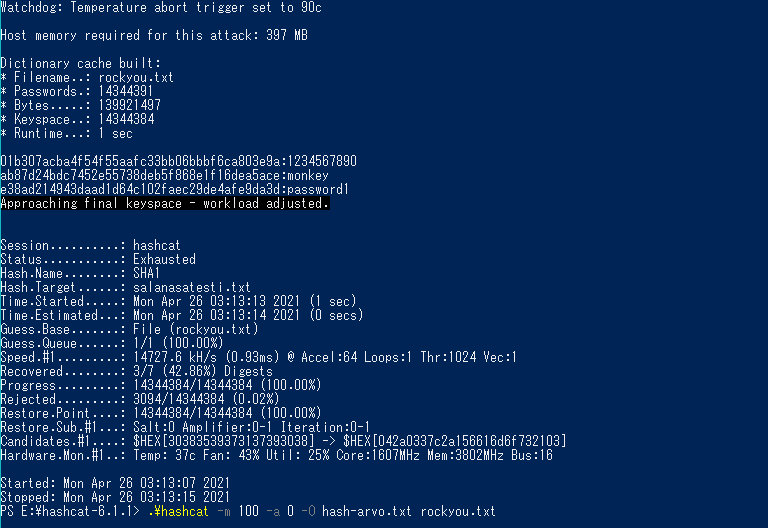
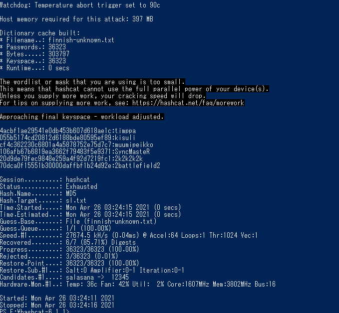

##A

John The Ripper ei kykene tunnistamaan hasheja /etc/passwd tiedostosta. Hashcat asennus ei onnistu, sillä en voi sudo apt-get update...

##B

Sateenkaaren avulla murrettuna SHA-1 muodossa oleva teksti murtuu. muttei kaikki.

Itse tehtynä Windows 10 hashcat ohjelmalla: 

Kaikkea salasanoja ei saatu revittyä auki, mutta nopeaa on, 7 sekuntia!

Taasen toisessa tehtävässä, mursi hashcat kaikki hashit suomi-salasanalistan avulla 5 sekunnissa!

